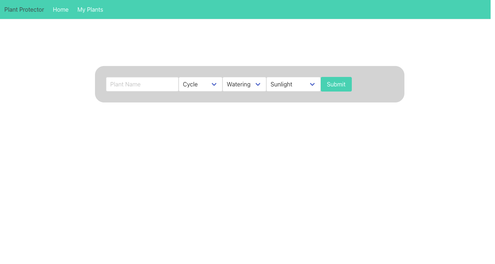
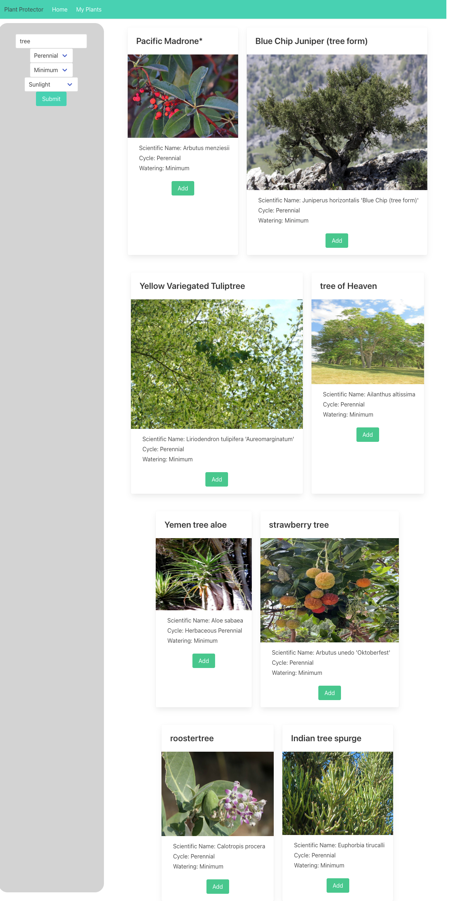

# Plant Protector Web App

## Description

This website was created in hopes to aid any plant care-takers. Sometimes it is hard to keep up with everything in a home and for those that like having flower pots or a garden outside their house would most likely benefit from having a website that gives you the insights of taking care of your plants. You can search a plant that you have or would like to have and a list of that type of plant should come up. You can choose from that list and save them to a page that displays the plants you chose with details about the plant. 

## Usage

You can access the website by inserting the following url: https://BertisJoey.github.io/Plant-Protector into your web browser. Once you get to the page you will find yourself with two tabs at the left top, a home page and a my plants page tab, and a search bar in the center. Before you input the kind of plant you want to search for, you can also choose from the dropdown options cycle, watering, and sunlight. Basically, you can choose what kind of cycle for the plant you want, how much watering, and how much sunlight you would want to provide. The following screenshots demonstrates how the website looks before you search. 

After you search for a plant, a list of cards with the images of plants and their names respectively should come up. The search bar moves to the left of the page and the plant cards follow to the right side. Each card has an add button. Once you click the add button, it will automatically be added to your plant page. Consequently, you can click on the my plants tab to be redirected the the list of plants you added. You can add as many as you would like and also delete the card if you do not want it in your list anymore. There will be an x button on the left bottom corner of the card which you can delete from. 

  

## Credits

There were 4 collaborators in total: Caleb Crouch, Joey Wiesner, Adrian Patton, and Giselle Torres-Villa. 
The following are the GitHub profiles for all the collaborators: 
Caleb Crouch: https://github.com/cecrouch01 
Joey Wiesner: https://github.com/BertisJoey
Adrian Patton: https://github.com/apatton33
Giselle Torres-Villa: https://github.com/gtorresv

We used the api from Perenual: https://perenual.com/docs/api.
Bulma was the css framework that we used: https://bulma.io/

We followed the bulma tutorial from The Net Ninja: https://www.youtube.com/playlist?list=PL4cUxeGkcC9iXItWKbaQxcyDT1u6E7a8a

## License

Please refer to the license in the repo.
